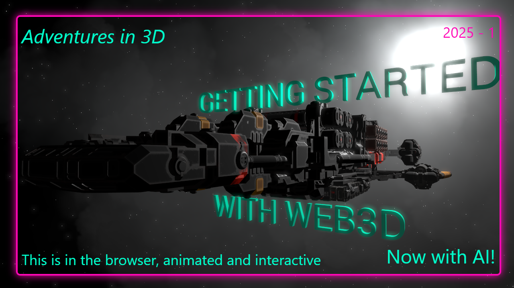

# Web3dAI
Template for Web3d development using AI development
     
# Why Github CoPilot?
    Github copilot is NOT the bleeding edge, and that's ok. Its' features tend to be a little more thought out, or refined after others have pioneered everything. It's cheap and accessible.

# Getting Started

**NOTE** you must supply your own model! It's simple, don;t miss this important step!

1. Run `npm install` or equivalent
2. copy your model to public folder and rename it to model.glb or model.gltf
3. run `npx gltfjsx@6.2.16 ./public/model.glb -o ./src/model.jsx` change .glb to .gltf if appropriate
2. Run `npm run dev` for dev mode

# Directory Structure

- src: root of the source code, typescript, vite, r3f, drei
- tests: unit tests
- docs: markdown files for reference and tasks to run
- public: static files to be referenced for the site, this is where you put glb/gtlf files

# Tutorial Series

- Getting Started + Series Intro
- General Model + Blender Prep
- Materials
- Lighting
- Effects
- Animations
- Interactions
- Procedural Generation

# Community

- Discord: https://discord.gg/pegfYcpCwT
